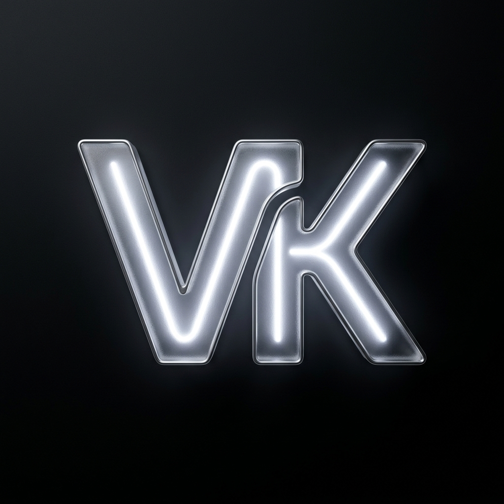

<div align="center">
  
  <h1>👨‍💻 Vamshi Krishna Nagula | AI & Full Stack Developer</h1>
  
  <p>
    <a href="https://github.com/Vamshikrishna0372"></a>
    <a href="https://www.linkedin.com/in/vamshi-krishna-nagula-174b6833a/"></a>
    <a href="https://vamshi-portfolio-original.vercel.app/"></a>
    <a href="./LICENSE"></a>
  </p>
  
  <p>A high-performance, interactive developer portfolio showcasing AI-native web solutions and scalable full-stack applications.</p>
</div>

---

## 🚀 Overview

This portfolio is a culmination of modern web engineering practices, focusing on **premium UI/UX, seamless animations, and robust backend integrations**. It features a production-ready **Email Automation System** that bridges the gap between client interaction and lead management.

### ✨ Key Features

- ⚡ **Turbo-Charged Performance**: Optimized using React + Vite for a blazing-fast experience.
- 🎨 **Artistic UI**: Fluid animations with **Framer Motion** and **GSAP**.
- 🧊 **Immersive interactions**: 3D tilt effects and custom cursor tracking.
- 📬 **Live Contact System**: 
  - Real-time form validation.
  - Backend message processing via **Node/Express**.
  - **SendGrid** integration for direct leads and automated user responses.
- 📱 **Adaptive Design**: Pixel-perfect responsiveness for mobile, tablet, and ultra-wide screens.

---

## 🛠️ Technology Ecosystem

### 🎨 Frontend Excellence


### ⚙️ Backend & Infrastructure


### 📬 Automation & Tools
- **SendGrid API**: Enterprise-grade email delivery.
- **GSAP**: High-fidelity scroll animations.
- **Shadcn/UI**: Accessible, Radix-based components.

---

## 📁 Architecture

```text
src/
├── components/        # Core UI blocks (Hero, Projects, Contact)
│   └── ui/           # Atomic Design System components
├── assets/           # Premium branding & static media
server/               # Express-based automation engine
├── routes/           # RESTful API endpoints
└── config/           # Secure environment orchestration
```

---

## 🚀 Setup & Deployment

1. **Clone & Install**
   ```bash
   git clone https://github.com/Vamshikrishna0372/Vamshi-Portfolio_Original.git
   cd Vamshi-Portfolio_Original
   npm install
   ```

2. **Backend Config**
   Create a `.env` in `server/`:
   ```env
   SENDGRID_API_KEY=your_key
   EMAIL_FROM=your_verified_email
   ```

3. **Production Mode**
   ```bash
   # Run both servers
   npm run dev
   cd server && npm start
   ```

---

## 🎯 Strategic Purpose

This project is not just a showcase—it's a demonstration of **bridging technical complexity with elegant design**. It proves my ability to handle end-to-end development, from branding assets to secure API infrastructure.

## 🤝 Let's Collaborate

I'm always open to discussing new projects, creative ideas, or opportunities in **AI and Full-Stack development**.

- 🔗 **LinkedIn**: [@Vamshikrishna-Nagula](https://www.linkedin.com/in/vamshi-krishna-nagula-174b6833a/)
- 📧 **Direct Email**: [nagulavamshi1453@gmail.com](mailto:nagulavamshi1453@gmail.com)
- 🌐 **Web**: [vamshi-portfolio.vercel.app](https://vamshi-portfolio-original.vercel.app/)

---

<p align="center">
  Proudly Engineered by <strong>Vamshi Krishna Nagula</strong> &copy; 2026
</p>
